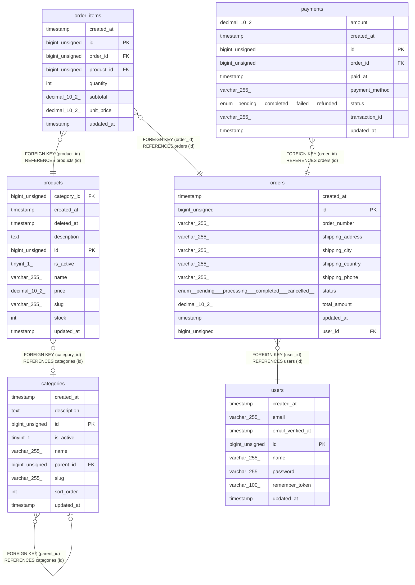

# laravel_test

## Tables

| Name                          | Columns | Comment | Type       |
| ----------------------------- | ------- | ------- | ---------- |
| [categories](categories.md)   | 9       |         | BASE TABLE |
| [order_items](order_items.md) | 8       |         | BASE TABLE |
| [orders](orders.md)           | 11      |         | BASE TABLE |
| [payments](payments.md)       | 9       |         | BASE TABLE |
| [products](products.md)       | 11      |         | BASE TABLE |
| [users](users.md)             | 8       |         | BASE TABLE |

## Relations

---

> Generated by [tbls](https://github.com/k1LoW/tbls)
