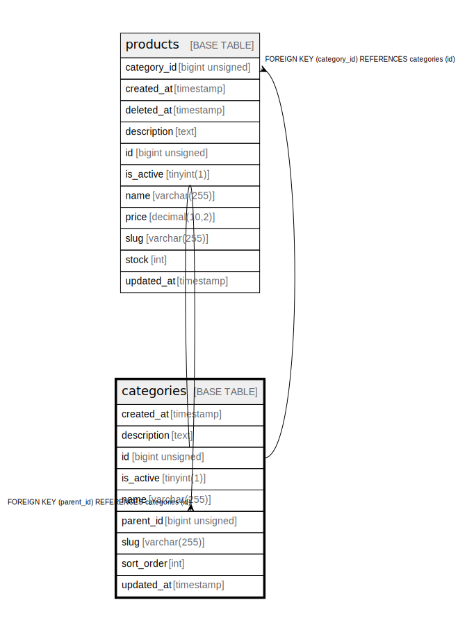

# categories

## Description

<details>
<summary><strong>Table Definition</strong></summary>

```sql
CREATE TABLE `categories` (
  `id` bigint unsigned NOT NULL AUTO_INCREMENT,
  `name` varchar(255) COLLATE utf8mb4_unicode_ci NOT NULL,
  `slug` varchar(255) COLLATE utf8mb4_unicode_ci NOT NULL,
  `description` text COLLATE utf8mb4_unicode_ci,
  `is_active` tinyint(1) NOT NULL DEFAULT '1',
  `parent_id` bigint unsigned DEFAULT NULL,
  `sort_order` int NOT NULL DEFAULT '0',
  `created_at` timestamp NULL DEFAULT NULL,
  `updated_at` timestamp NULL DEFAULT NULL,
  PRIMARY KEY (`id`),
  UNIQUE KEY `categories_slug_unique` (`slug`),
  KEY `categories_parent_id_foreign` (`parent_id`),
  CONSTRAINT `categories_parent_id_foreign` FOREIGN KEY (`parent_id`) REFERENCES `categories` (`id`) ON DELETE SET NULL
) ENGINE=InnoDB DEFAULT CHARSET=utf8mb4 COLLATE=utf8mb4_unicode_ci
```

</details>

## Columns

| Name        | Type            | Default | Nullable | Extra Definition | Children                                            | Parents                     | Comment |
| ----------- | --------------- | ------- | -------- | ---------------- | --------------------------------------------------- | --------------------------- | ------- |
| created_at  | timestamp       |         | true     |                  |                                                     |                             |         |
| description | text            |         | true     |                  |                                                     |                             |         |
| id          | bigint unsigned |         | false    | auto_increment   | [categories](categories.md) [products](products.md) |                             |         |
| is_active   | tinyint(1)      | 1       | false    |                  |                                                     |                             |         |
| name        | varchar(255)    |         | false    |                  |                                                     |                             |         |
| parent_id   | bigint unsigned |         | true     |                  |                                                     | [categories](categories.md) |         |
| slug        | varchar(255)    |         | false    |                  |                                                     |                             |         |
| sort_order  | int             | 0       | false    |                  |                                                     |                             |         |
| updated_at  | timestamp       |         | true     |                  |                                                     |                             |         |

## Constraints

| Name                         | Type        | Definition                                         |
| ---------------------------- | ----------- | -------------------------------------------------- |
| PRIMARY                      | PRIMARY KEY | PRIMARY KEY (id)                                   |
| categories_parent_id_foreign | FOREIGN KEY | FOREIGN KEY (parent_id) REFERENCES categories (id) |
| categories_slug_unique       | UNIQUE      | UNIQUE KEY categories_slug_unique (slug)           |

## Indexes

| Name                         | Definition                                               |
| ---------------------------- | -------------------------------------------------------- |
| PRIMARY                      | PRIMARY KEY (id) USING BTREE                             |
| categories_parent_id_foreign | KEY categories_parent_id_foreign (parent_id) USING BTREE |
| categories_slug_unique       | UNIQUE KEY categories_slug_unique (slug) USING BTREE     |

## Relations



---

> Generated by [tbls](https://github.com/k1LoW/tbls)
