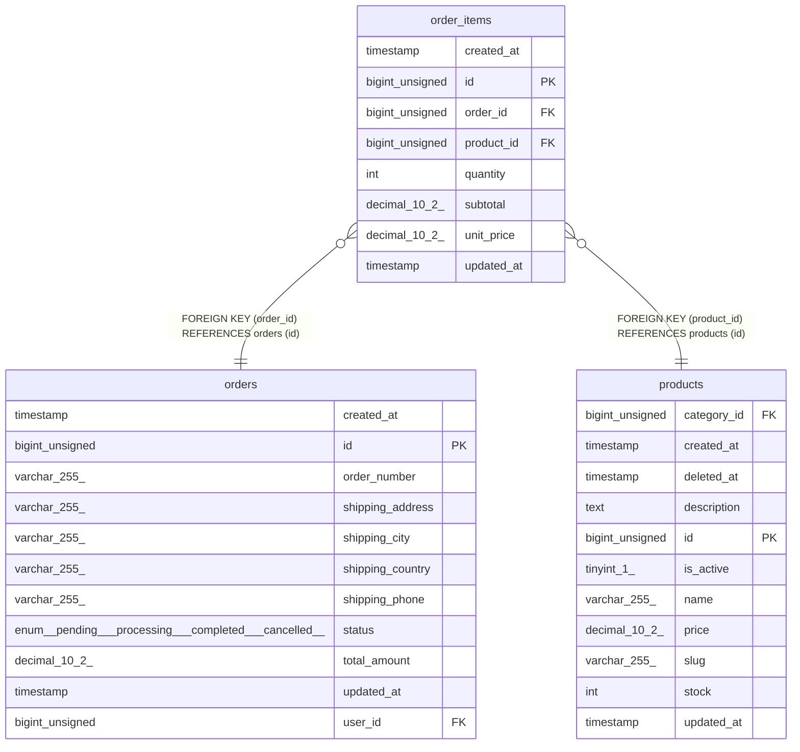

# order_items

## Description

<details>
<summary><strong>Table Definition</strong></summary>

```sql
CREATE TABLE `order_items` (
  `id` bigint unsigned NOT NULL AUTO_INCREMENT,
  `order_id` bigint unsigned NOT NULL,
  `product_id` bigint unsigned NOT NULL,
  `quantity` int NOT NULL,
  `unit_price` decimal(10,2) NOT NULL,
  `subtotal` decimal(10,2) NOT NULL,
  `created_at` timestamp NULL DEFAULT NULL,
  `updated_at` timestamp NULL DEFAULT NULL,
  PRIMARY KEY (`id`),
  KEY `order_items_order_id_foreign` (`order_id`),
  KEY `order_items_product_id_foreign` (`product_id`),
  CONSTRAINT `order_items_order_id_foreign` FOREIGN KEY (`order_id`) REFERENCES `orders` (`id`) ON DELETE CASCADE,
  CONSTRAINT `order_items_product_id_foreign` FOREIGN KEY (`product_id`) REFERENCES `products` (`id`) ON DELETE CASCADE
) ENGINE=InnoDB DEFAULT CHARSET=utf8mb4 COLLATE=utf8mb4_unicode_ci
```

</details>

## Columns

| Name       | Type            | Default | Nullable | Extra Definition | Children | Parents                 | Comment |
| ---------- | --------------- | ------- | -------- | ---------------- | -------- | ----------------------- | ------- |
| created_at | timestamp       |         | true     |                  |          |                         |         |
| id         | bigint unsigned |         | false    | auto_increment   |          |                         |         |
| order_id   | bigint unsigned |         | false    |                  |          | [orders](orders.md)     |         |
| product_id | bigint unsigned |         | false    |                  |          | [products](products.md) |         |
| quantity   | int             |         | false    |                  |          |                         |         |
| subtotal   | decimal(10,2)   |         | false    |                  |          |                         |         |
| unit_price | decimal(10,2)   |         | false    |                  |          |                         |         |
| updated_at | timestamp       |         | true     |                  |          |                         |         |

## Constraints

| Name                           | Type        | Definition                                        |
| ------------------------------ | ----------- | ------------------------------------------------- |
| PRIMARY                        | PRIMARY KEY | PRIMARY KEY (id)                                  |
| order_items_order_id_foreign   | FOREIGN KEY | FOREIGN KEY (order_id) REFERENCES orders (id)     |
| order_items_product_id_foreign | FOREIGN KEY | FOREIGN KEY (product_id) REFERENCES products (id) |

## Indexes

| Name                           | Definition                                                  |
| ------------------------------ | ----------------------------------------------------------- |
| PRIMARY                        | PRIMARY KEY (id) USING BTREE                                |
| order_items_order_id_foreign   | KEY order_items_order_id_foreign (order_id) USING BTREE     |
| order_items_product_id_foreign | KEY order_items_product_id_foreign (product_id) USING BTREE |

## Relations



---

> Generated by [tbls](https://github.com/k1LoW/tbls)
