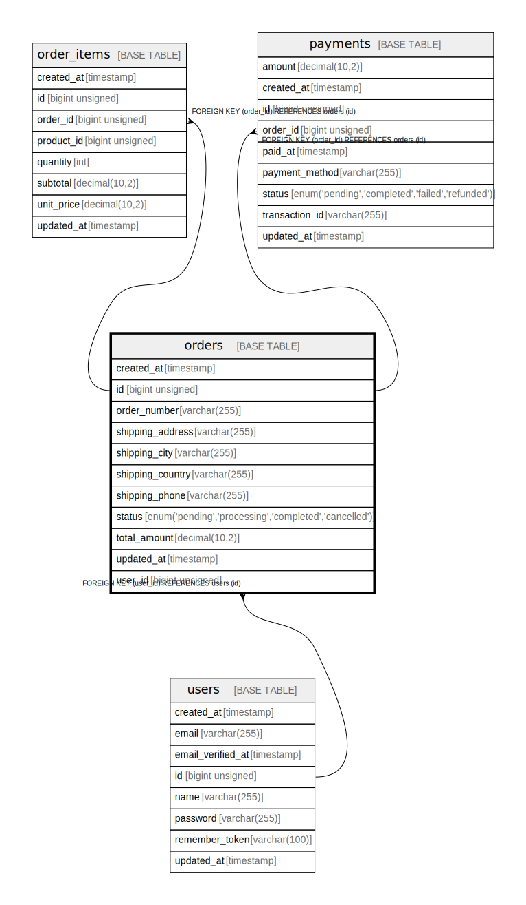

# orders

## Description

<details>
<summary><strong>Table Definition</strong></summary>

```sql
CREATE TABLE `orders` (
  `id` bigint unsigned NOT NULL AUTO_INCREMENT,
  `user_id` bigint unsigned NOT NULL,
  `order_number` varchar(255) COLLATE utf8mb4_unicode_ci NOT NULL,
  `total_amount` decimal(10,2) NOT NULL,
  `status` enum('pending','processing','completed','cancelled') COLLATE utf8mb4_unicode_ci NOT NULL DEFAULT 'pending',
  `shipping_address` varchar(255) COLLATE utf8mb4_unicode_ci NOT NULL,
  `shipping_city` varchar(255) COLLATE utf8mb4_unicode_ci NOT NULL,
  `shipping_country` varchar(255) COLLATE utf8mb4_unicode_ci NOT NULL,
  `shipping_phone` varchar(255) COLLATE utf8mb4_unicode_ci NOT NULL,
  `created_at` timestamp NULL DEFAULT NULL,
  `updated_at` timestamp NULL DEFAULT NULL,
  PRIMARY KEY (`id`),
  UNIQUE KEY `orders_order_number_unique` (`order_number`),
  KEY `orders_user_id_foreign` (`user_id`),
  CONSTRAINT `orders_user_id_foreign` FOREIGN KEY (`user_id`) REFERENCES `users` (`id`) ON DELETE CASCADE
) ENGINE=InnoDB DEFAULT CHARSET=utf8mb4 COLLATE=utf8mb4_unicode_ci
```

</details>

## Columns

| Name             | Type                                                 | Default | Nullable | Extra Definition | Children                                              | Parents           | Comment |
| ---------------- | ---------------------------------------------------- | ------- | -------- | ---------------- | ----------------------------------------------------- | ----------------- | ------- |
| created_at       | timestamp                                            |         | true     |                  |                                                       |                   |         |
| id               | bigint unsigned                                      |         | false    | auto_increment   | [order_items](order_items.md) [payments](payments.md) |                   |         |
| order_number     | varchar(255)                                         |         | false    |                  |                                                       |                   |         |
| shipping_address | varchar(255)                                         |         | false    |                  |                                                       |                   |         |
| shipping_city    | varchar(255)                                         |         | false    |                  |                                                       |                   |         |
| shipping_country | varchar(255)                                         |         | false    |                  |                                                       |                   |         |
| shipping_phone   | varchar(255)                                         |         | false    |                  |                                                       |                   |         |
| status           | enum('pending','processing','completed','cancelled') | pending | false    |                  |                                                       |                   |         |
| total_amount     | decimal(10,2)                                        |         | false    |                  |                                                       |                   |         |
| updated_at       | timestamp                                            |         | true     |                  |                                                       |                   |         |
| user_id          | bigint unsigned                                      |         | false    |                  |                                                       | [users](users.md) |         |

## Constraints

| Name                       | Type        | Definition                                           |
| -------------------------- | ----------- | ---------------------------------------------------- |
| PRIMARY                    | PRIMARY KEY | PRIMARY KEY (id)                                     |
| orders_order_number_unique | UNIQUE      | UNIQUE KEY orders_order_number_unique (order_number) |
| orders_user_id_foreign     | FOREIGN KEY | FOREIGN KEY (user_id) REFERENCES users (id)          |

## Indexes

| Name                       | Definition                                                       |
| -------------------------- | ---------------------------------------------------------------- |
| PRIMARY                    | PRIMARY KEY (id) USING BTREE                                     |
| orders_order_number_unique | UNIQUE KEY orders_order_number_unique (order_number) USING BTREE |
| orders_user_id_foreign     | KEY orders_user_id_foreign (user_id) USING BTREE                 |

## Relations



---

> Generated by [tbls](https://github.com/k1LoW/tbls)
