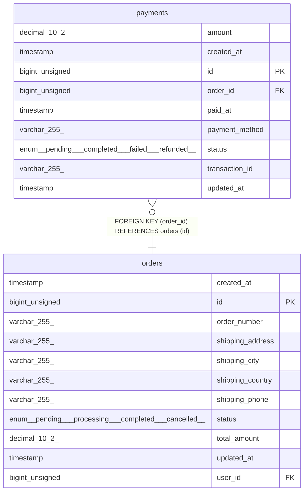

# payments

## Description

<details>
<summary><strong>Table Definition</strong></summary>

```sql
CREATE TABLE `payments` (
  `id` bigint unsigned NOT NULL AUTO_INCREMENT,
  `order_id` bigint unsigned NOT NULL,
  `payment_method` varchar(255) COLLATE utf8mb4_unicode_ci NOT NULL,
  `transaction_id` varchar(255) COLLATE utf8mb4_unicode_ci NOT NULL,
  `amount` decimal(10,2) NOT NULL,
  `status` enum('pending','completed','failed','refunded') COLLATE utf8mb4_unicode_ci NOT NULL DEFAULT 'pending',
  `paid_at` timestamp NULL DEFAULT NULL,
  `created_at` timestamp NULL DEFAULT NULL,
  `updated_at` timestamp NULL DEFAULT NULL,
  PRIMARY KEY (`id`),
  UNIQUE KEY `payments_transaction_id_unique` (`transaction_id`),
  KEY `payments_order_id_foreign` (`order_id`),
  CONSTRAINT `payments_order_id_foreign` FOREIGN KEY (`order_id`) REFERENCES `orders` (`id`) ON DELETE CASCADE
) ENGINE=InnoDB DEFAULT CHARSET=utf8mb4 COLLATE=utf8mb4_unicode_ci
```

</details>

## Columns

| Name           | Type                                            | Default | Nullable | Extra Definition | Children | Parents             | Comment |
| -------------- | ----------------------------------------------- | ------- | -------- | ---------------- | -------- | ------------------- | ------- |
| amount         | decimal(10,2)                                   |         | false    |                  |          |                     |         |
| created_at     | timestamp                                       |         | true     |                  |          |                     |         |
| id             | bigint unsigned                                 |         | false    | auto_increment   |          |                     |         |
| order_id       | bigint unsigned                                 |         | false    |                  |          | [orders](orders.md) |         |
| paid_at        | timestamp                                       |         | true     |                  |          |                     |         |
| payment_method | varchar(255)                                    |         | false    |                  |          |                     |         |
| status         | enum('pending','completed','failed','refunded') | pending | false    |                  |          |                     |         |
| transaction_id | varchar(255)                                    |         | false    |                  |          |                     |         |
| updated_at     | timestamp                                       |         | true     |                  |          |                     |         |

## Constraints

| Name                           | Type        | Definition                                                 |
| ------------------------------ | ----------- | ---------------------------------------------------------- |
| PRIMARY                        | PRIMARY KEY | PRIMARY KEY (id)                                           |
| payments_order_id_foreign      | FOREIGN KEY | FOREIGN KEY (order_id) REFERENCES orders (id)              |
| payments_transaction_id_unique | UNIQUE      | UNIQUE KEY payments_transaction_id_unique (transaction_id) |

## Indexes

| Name                           | Definition                                                             |
| ------------------------------ | ---------------------------------------------------------------------- |
| PRIMARY                        | PRIMARY KEY (id) USING BTREE                                           |
| payments_order_id_foreign      | KEY payments_order_id_foreign (order_id) USING BTREE                   |
| payments_transaction_id_unique | UNIQUE KEY payments_transaction_id_unique (transaction_id) USING BTREE |

## Relations



---

> Generated by [tbls](https://github.com/k1LoW/tbls)
