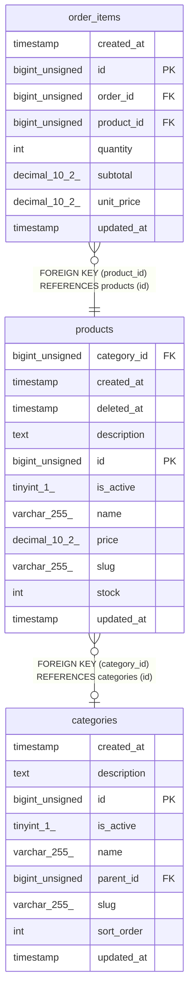

# products

## Description

<details>
<summary><strong>Table Definition</strong></summary>

```sql
CREATE TABLE `products` (
  `id` bigint unsigned NOT NULL AUTO_INCREMENT,
  `name` varchar(255) COLLATE utf8mb4_unicode_ci NOT NULL,
  `slug` varchar(255) COLLATE utf8mb4_unicode_ci NOT NULL,
  `description` text COLLATE utf8mb4_unicode_ci,
  `price` decimal(10,2) NOT NULL,
  `stock` int NOT NULL DEFAULT '0',
  `is_active` tinyint(1) NOT NULL DEFAULT '1',
  `category_id` bigint unsigned DEFAULT NULL,
  `created_at` timestamp NULL DEFAULT NULL,
  `updated_at` timestamp NULL DEFAULT NULL,
  `deleted_at` timestamp NULL DEFAULT NULL,
  PRIMARY KEY (`id`),
  UNIQUE KEY `products_slug_unique` (`slug`),
  KEY `products_category_id_foreign` (`category_id`),
  CONSTRAINT `products_category_id_foreign` FOREIGN KEY (`category_id`) REFERENCES `categories` (`id`) ON DELETE SET NULL
) ENGINE=InnoDB DEFAULT CHARSET=utf8mb4 COLLATE=utf8mb4_unicode_ci
```

</details>

## Columns

| Name        | Type            | Default | Nullable | Extra Definition | Children                      | Parents                     | Comment |
| ----------- | --------------- | ------- | -------- | ---------------- | ----------------------------- | --------------------------- | ------- |
| category_id | bigint unsigned |         | true     |                  |                               | [categories](categories.md) |         |
| created_at  | timestamp       |         | true     |                  |                               |                             |         |
| deleted_at  | timestamp       |         | true     |                  |                               |                             |         |
| description | text            |         | true     |                  |                               |                             |         |
| id          | bigint unsigned |         | false    | auto_increment   | [order_items](order_items.md) |                             |         |
| is_active   | tinyint(1)      | 1       | false    |                  |                               |                             |         |
| name        | varchar(255)    |         | false    |                  |                               |                             |         |
| price       | decimal(10,2)   |         | false    |                  |                               |                             |         |
| slug        | varchar(255)    |         | false    |                  |                               |                             |         |
| stock       | int             | 0       | false    |                  |                               |                             |         |
| updated_at  | timestamp       |         | true     |                  |                               |                             |         |

## Constraints

| Name                         | Type        | Definition                                           |
| ---------------------------- | ----------- | ---------------------------------------------------- |
| PRIMARY                      | PRIMARY KEY | PRIMARY KEY (id)                                     |
| products_category_id_foreign | FOREIGN KEY | FOREIGN KEY (category_id) REFERENCES categories (id) |
| products_slug_unique         | UNIQUE      | UNIQUE KEY products_slug_unique (slug)               |

## Indexes

| Name                         | Definition                                                 |
| ---------------------------- | ---------------------------------------------------------- |
| PRIMARY                      | PRIMARY KEY (id) USING BTREE                               |
| products_category_id_foreign | KEY products_category_id_foreign (category_id) USING BTREE |
| products_slug_unique         | UNIQUE KEY products_slug_unique (slug) USING BTREE         |

## Relations



---

> Generated by [tbls](https://github.com/k1LoW/tbls)
