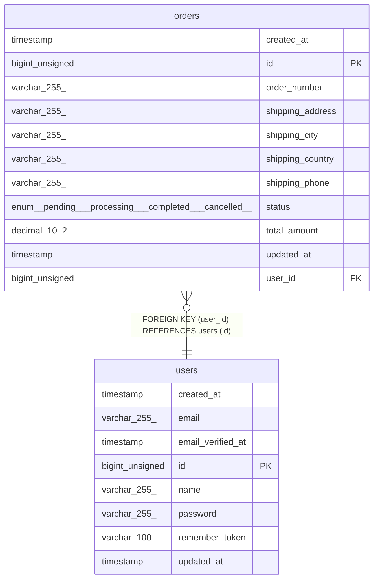

# users

## Description

<details>
<summary><strong>Table Definition</strong></summary>

```sql
CREATE TABLE `users` (
  `id` bigint unsigned NOT NULL AUTO_INCREMENT,
  `name` varchar(255) COLLATE utf8mb4_unicode_ci NOT NULL,
  `email` varchar(255) COLLATE utf8mb4_unicode_ci NOT NULL,
  `email_verified_at` timestamp NULL DEFAULT NULL,
  `password` varchar(255) COLLATE utf8mb4_unicode_ci NOT NULL,
  `remember_token` varchar(100) COLLATE utf8mb4_unicode_ci DEFAULT NULL,
  `created_at` timestamp NULL DEFAULT NULL,
  `updated_at` timestamp NULL DEFAULT NULL,
  PRIMARY KEY (`id`),
  UNIQUE KEY `users_email_unique` (`email`)
) ENGINE=InnoDB DEFAULT CHARSET=utf8mb4 COLLATE=utf8mb4_unicode_ci
```

</details>

## Columns

| Name              | Type            | Default | Nullable | Extra Definition | Children            | Parents | Comment |
| ----------------- | --------------- | ------- | -------- | ---------------- | ------------------- | ------- | ------- |
| created_at        | timestamp       |         | true     |                  |                     |         |         |
| email             | varchar(255)    |         | false    |                  |                     |         |         |
| email_verified_at | timestamp       |         | true     |                  |                     |         |         |
| id                | bigint unsigned |         | false    | auto_increment   | [orders](orders.md) |         |         |
| name              | varchar(255)    |         | false    |                  |                     |         |         |
| password          | varchar(255)    |         | false    |                  |                     |         |         |
| remember_token    | varchar(100)    |         | true     |                  |                     |         |         |
| updated_at        | timestamp       |         | true     |                  |                     |         |         |

## Constraints

| Name               | Type        | Definition                            |
| ------------------ | ----------- | ------------------------------------- |
| PRIMARY            | PRIMARY KEY | PRIMARY KEY (id)                      |
| users_email_unique | UNIQUE      | UNIQUE KEY users_email_unique (email) |

## Indexes

| Name               | Definition                                        |
| ------------------ | ------------------------------------------------- |
| PRIMARY            | PRIMARY KEY (id) USING BTREE                      |
| users_email_unique | UNIQUE KEY users_email_unique (email) USING BTREE |

## Relations



---

> Generated by [tbls](https://github.com/k1LoW/tbls)
